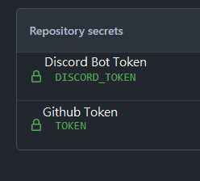
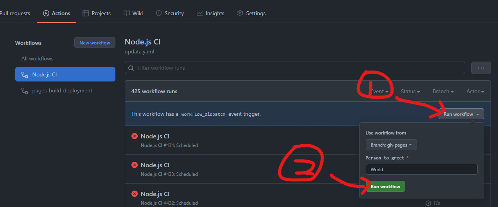

# myit

a blog website for my discord group : https://discord.gg/myit  
https://hello1234316.github.io/myit/

>Fonts:  
>王漢宗特黑體繁: https://wordshub.github.io/free-font/font.html?WangHanZongTeHeiTiFan_Regular  
>王漢宗中仿宋繁: https://wordshub.github.io/free-font/font.html?WangHanZongZhongFangSongFan_Regular#try

 
請添加兩個 參數 /settings/secrets/actions  
ex: https://github.com/a3510377/myit/settings/secrets/actions

1. `TOKEN`: Github Token
2. `DISCORD_TOKEN`: Discord Token

本儲存庫使用 `Github Actions` 進行更新，預設於 `每小時` 或 `手動` 更新

